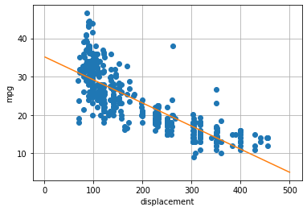
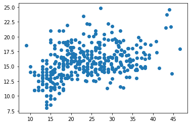

## **Lab 2: Simple Linear Regression**

### **1. Manipulate the data $ \text{fd}_{(398x6)} $**

Tasks: 

*   Load the data with: `pdf.read_csv()`
*   Show the array, get array size and list x items and get: `.values`, `.shape` & `.head()`
*   Display data of the column of cylinders & mpg: `df['cylinders']` & `df[['cylinders','mpg']]`


```python
import pandas as pd
import numpy as np
myhead = ['mpg','cylinder','displacement','horsepower','weight','acceleration','model year','origin','car name'];
fd = pd.read_csv('https://archive.ics.uci.edu/ml/machine-learning-databases/auto-mpg/auto-mpg.data',header=None,delim_whitespace=True,names=myhead,na_values='?');
fd.head(5)
```


<div>
<style scoped>
    .dataframe tbody tr th:only-of-type {
        vertical-align: middle;
    }

    .dataframe tbody tr th {
        vertical-align: top;
    }

    .dataframe thead th {
        text-align: right;
    }
</style>
<table border="1" class="dataframe">
  <thead>
    <tr style="text-align: right;">
      <th></th>
      <th>mpg</th>
      <th>cylinder</th>
      <th>displacement</th>
      <th>horsepower</th>
      <th>weight</th>
      <th>acceleration</th>
      <th>model year</th>
      <th>origin</th>
      <th>car name</th>
    </tr>
  </thead>
  <tbody>
    <tr>
      <th>0</th>
      <td>18.0</td>
      <td>8</td>
      <td>307.0</td>
      <td>130.0</td>
      <td>3504.0</td>
      <td>12.0</td>
      <td>70</td>
      <td>1</td>
      <td>chevrolet chevelle malibu</td>
    </tr>
    <tr>
      <th>1</th>
      <td>15.0</td>
      <td>8</td>
      <td>350.0</td>
      <td>165.0</td>
      <td>3693.0</td>
      <td>11.5</td>
      <td>70</td>
      <td>1</td>
      <td>buick skylark 320</td>
    </tr>
    <tr>
      <th>2</th>
      <td>18.0</td>
      <td>8</td>
      <td>318.0</td>
      <td>150.0</td>
      <td>3436.0</td>
      <td>11.0</td>
      <td>70</td>
      <td>1</td>
      <td>plymouth satellite</td>
    </tr>
    <tr>
      <th>3</th>
      <td>16.0</td>
      <td>8</td>
      <td>304.0</td>
      <td>150.0</td>
      <td>3433.0</td>
      <td>12.0</td>
      <td>70</td>
      <td>1</td>
      <td>amc rebel sst</td>
    </tr>
    <tr>
      <th>4</th>
      <td>17.0</td>
      <td>8</td>
      <td>302.0</td>
      <td>140.0</td>
      <td>3449.0</td>
      <td>10.5</td>
      <td>70</td>
      <td>1</td>
      <td>ford torino</td>
    </tr>
  </tbody>
</table>
</div>


```python
import numpy as np
import pandas as pd
import matplotlib
import matplotlib.pyplot as plt


%matplotlib inline

myhead = ['mpg','cylinder','displacement','horsepower','weight','acceleration','model year','origin','car name'];
fd = pd.read_csv('https://archive.ics.uci.edu/ml/machine-learning-databases/auto-mpg/auto-mpg.data',header=None,delim_whitespace=True,names=myhead,na_values='?');

x = np.array(fd['displacement']);
y = np.array(fd['mpg']);

```


```python
dfshow = fd[['displacement','horsepower']]
dfshow.head(4)
```


<div>
<style scoped>
    .dataframe tbody tr th:only-of-type {
        vertical-align: middle;
    }

    .dataframe tbody tr th {
        vertical-align: top;
    }

    .dataframe thead th {
        text-align: right;
    }
</style>
<table border="1" class="dataframe">
  <thead>
    <tr style="text-align: right;">
      <th></th>
      <th>displacement</th>
      <th>horsepower</th>
    </tr>
  </thead>
  <tbody>
    <tr>
      <th>0</th>
      <td>307.0</td>
      <td>130.0</td>
    </tr>
    <tr>
      <th>1</th>
      <td>350.0</td>
      <td>165.0</td>
    </tr>
    <tr>
      <th>2</th>
      <td>318.0</td>
      <td>150.0</td>
    </tr>
    <tr>
      <th>3</th>
      <td>304.0</td>
      <td>150.0</td>
    </tr>
  </tbody>
</table>
</div>


### **2. Compute the means ($\bar{x}, \bar{y}$), covariance ($S_{xy}, S_{xx}$) and $\beta$s as:**
$$
\begin{align}
\bar{x} &= \frac{1}{N}\sum_{i=1}^{N}{(x_i)} &
\bar{y} &= \frac{1}{N}\sum_{i=1}^{N}{(y_i)} \\
s_{xy} &= \frac{1}{N}\sum_{i=1}^{N}{(x_i-\bar{x})(y_i-\bar{y})} &
S^2_{x}  &= S_{xx}= \frac{1}{N}\sum_{i=1}^{N}{(x_i - \bar{x})^2} \\
\beta_1 &= \frac{S_{xy}}{S^2_{x}} = \frac{r_{xy}S_{y}}{S_{x}}&
\beta_0 &= \bar{y}-\beta_1\bar{x}\\
RSS_{(\beta_0,\beta_1)} &:=\sum^n_{i=1}{(y_i-\hat{y}_i)^2} &
\hat{y}_i &= \beta_1x_i + \beta_0
\end{align}
$$
Tasks:


*   Show values with decimals: `print({:.3f}.format(xm))` or `print('%.2f' %xm)`


```python
xm = np.mean(x);
ym = np.mean(y);

print("xm: %.2f" %xm,"and ym: %.2f" %ym)
print('thi is xm: {:.3f}'.format(xm),'thi is ym: {:.3f}'.format(ym))

syx = np.mean((y-ym)*(x-xm))
sxx = np.mean((x-xm)**2);
syy = np.mean((y-ym)**2);
beta1 = syx/sxx;
beta0 = ym - beta1*xm;
print("beta_1: ",beta1);
print("beta_0:",beta0);

#fig, ax = plt.subplots()
plt.plot(x,y,'o');
plt.xlabel('displacement');
plt.ylabel('mpg');
plt.grid(True)

#print(len(x))
xlines=np.linspace(1,500,600)      # from 1 to 10, by 50
plt.plot(xlines, beta0 +beta1*xlines )        # abline
plt.show()
```

    xm: 193.43 and ym: 23.51
    thi is xm: 193.426 thi is ym: 23.515
    beta_1:  -0.06028240546881722
    beta_0: 35.17475015429319


    

    


### **3. Pick interval with condition and drop NA values**
Tasks:

  **3.1**   Pick values of y (mpg) so that its acceleration `acc>25`<br>
  **3.2**  List items and drop the ones who don't have a value or are empty

Example: Pick all $a_n | b_n>2$
$$
a_n\,\,\,b_n\\
\begin{bmatrix}
6 & 2\\
8 & 4\\
4 & 8
\end{bmatrix}
$$
Then $a_n=\{8,4\}$, in programming to calculate the mean of such $a_n$ with that condition, it'll be `print(np.mean(an[bn>2]))` 


```python
val = np.array([[6,2],[8,4],[4,8]])
xn = val[:,0]
print(xn)
yn = val[:,1]
I = (yn>2)
print(I)
print(np.mean(xn*I)/np.mean(I))
print(np.mean(xn*I))
print(np.mean(xn[yn>2]))
```

    [6 8 4]
    [False  True  True]
    6.0
    4.0
    6.0


```python
#3.1 Pick values of y (mpg) so that its acceleration acc>25
# %%%%%%%%%%%%%%%%%%%%%%%%%%%%%%%%%%%%%%%%%%%%%%%%%%%%%%%%%%%%
acc = np.array(fd['acceleration'])
plt.plot(y,acc,'o')
print('Mean of mpg | acc>25: %.2f' %np.mean(y[acc>15]))
```

    Mean of mpg | acc>25: 25.85


    

    


```python
!jupyter nbconvert --execute --to markdown Lec02.ipynb
```

    [NbConvertApp] WARNING | pattern 'Lec02.ipynb' matched no files
    This application is used to convert notebook files (*.ipynb)
            to various other formats.
    
            WARNING: THE COMMANDLINE INTERFACE MAY CHANGE IN FUTURE RELEASES.
    
    Options
    =======
    The options below are convenience aliases to configurable class-options,
    as listed in the "Equivalent to" description-line of the aliases.
    To see all configurable class-options for some <cmd>, use:
        <cmd> --help-all
    
    --debug
        set log level to logging.DEBUG (maximize logging output)
        Equivalent to: [--Application.log_level=10]
    --show-config
        Show the application's configuration (human-readable format)
        Equivalent to: [--Application.show_config=True]
    --show-config-json
        Show the application's configuration (json format)
        Equivalent to: [--Application.show_config_json=True]
    --generate-config
        generate default config file
        Equivalent to: [--JupyterApp.generate_config=True]
    -y
        Answer yes to any questions instead of prompting.
        Equivalent to: [--JupyterApp.answer_yes=True]
    --execute
        Execute the notebook prior to export.
        Equivalent to: [--ExecutePreprocessor.enabled=True]
    --allow-errors
        Continue notebook execution even if one of the cells throws an error and include the error message in the cell output (the default behaviour is to abort conversion). This flag is only relevant if '--execute' was specified, too.
        Equivalent to: [--ExecutePreprocessor.allow_errors=True]
    --stdin
        read a single notebook file from stdin. Write the resulting notebook with default basename 'notebook.*'
        Equivalent to: [--NbConvertApp.from_stdin=True]
    --stdout
        Write notebook output to stdout instead of files.
        Equivalent to: [--NbConvertApp.writer_class=StdoutWriter]
    --inplace
        Run nbconvert in place, overwriting the existing notebook (only
                relevant when converting to notebook format)
        Equivalent to: [--NbConvertApp.use_output_suffix=False --NbConvertApp.export_format=notebook --FilesWriter.build_directory=]
    --clear-output
        Clear output of current file and save in place,
                overwriting the existing notebook.
        Equivalent to: [--NbConvertApp.use_output_suffix=False --NbConvertApp.export_format=notebook --FilesWriter.build_directory= --ClearOutputPreprocessor.enabled=True]
    --no-prompt
        Exclude input and output prompts from converted document.
        Equivalent to: [--TemplateExporter.exclude_input_prompt=True --TemplateExporter.exclude_output_prompt=True]
    --no-input
        Exclude input cells and output prompts from converted document.
                This mode is ideal for generating code-free reports.
        Equivalent to: [--TemplateExporter.exclude_output_prompt=True --TemplateExporter.exclude_input=True --TemplateExporter.exclude_input_prompt=True]
    --allow-chromium-download
        Whether to allow downloading chromium if no suitable version is found on the system.
        Equivalent to: [--WebPDFExporter.allow_chromium_download=True]
    --disable-chromium-sandbox
        Disable chromium security sandbox when converting to PDF..
        Equivalent to: [--WebPDFExporter.disable_sandbox=True]
    --show-input
        Shows code input. This flag is only useful for dejavu users.
        Equivalent to: [--TemplateExporter.exclude_input=False]
    --embed-images
        Embed the images as base64 dataurls in the output. This flag is only useful for the HTML/WebPDF/Slides exports.
        Equivalent to: [--HTMLExporter.embed_images=True]
    --log-level=<Enum>
        Set the log level by value or name.
        Choices: any of [0, 10, 20, 30, 40, 50, 'DEBUG', 'INFO', 'WARN', 'ERROR', 'CRITICAL']
        Default: 30
        Equivalent to: [--Application.log_level]
    --config=<Unicode>
        Full path of a config file.
        Default: ''
        Equivalent to: [--JupyterApp.config_file]
    --to=<Unicode>
        The export format to be used, either one of the built-in formats
                ['asciidoc', 'custom', 'html', 'latex', 'markdown', 'notebook', 'pdf', 'python', 'rst', 'script', 'slides', 'webpdf']
                or a dotted object name that represents the import path for an
                ``Exporter`` class
        Default: ''
        Equivalent to: [--NbConvertApp.export_format]
    --template=<Unicode>
        Name of the template to use
        Default: ''
        Equivalent to: [--TemplateExporter.template_name]
    --template-file=<Unicode>
        Name of the template file to use
        Default: None
        Equivalent to: [--TemplateExporter.template_file]
    --theme=<Unicode>
        Template specific theme(e.g. the name of a JupyterLab CSS theme distributed
        as prebuilt extension for the lab template)
        Default: 'light'
        Equivalent to: [--HTMLExporter.theme]
    --writer=<DottedObjectName>
        Writer class used to write the
                                            results of the conversion
        Default: 'FilesWriter'
        Equivalent to: [--NbConvertApp.writer_class]
    --post=<DottedOrNone>
        PostProcessor class used to write the
                                            results of the conversion
        Default: ''
        Equivalent to: [--NbConvertApp.postprocessor_class]
    --output=<Unicode>
        overwrite base name use for output files.
                    can only be used when converting one notebook at a time.
        Default: ''
        Equivalent to: [--NbConvertApp.output_base]
    --output-dir=<Unicode>
        Directory to write output(s) to. Defaults
                                      to output to the directory of each notebook. To recover
                                      previous default behaviour (outputting to the current
                                      working directory) use . as the flag value.
        Default: ''
        Equivalent to: [--FilesWriter.build_directory]
    --reveal-prefix=<Unicode>
        The URL prefix for reveal.js (version 3.x).
                This defaults to the reveal CDN, but can be any url pointing to a copy
                of reveal.js.
                For speaker notes to work, this must be a relative path to a local
                copy of reveal.js: e.g., "reveal.js".
                If a relative path is given, it must be a subdirectory of the
                current directory (from which the server is run).
                See the usage documentation
                (https://nbconvert.readthedocs.io/en/latest/usage.html#reveal-js-html-slideshow)
                for more details.
        Default: ''
        Equivalent to: [--SlidesExporter.reveal_url_prefix]
    --nbformat=<Enum>
        The nbformat version to write.
                Use this to downgrade notebooks.
        Choices: any of [1, 2, 3, 4]
        Default: 4
        Equivalent to: [--NotebookExporter.nbformat_version]
    
    Examples
    --------
    
        The simplest way to use nbconvert is
    
                > jupyter nbconvert mynotebook.ipynb --to html
    
                Options include ['asciidoc', 'custom', 'html', 'latex', 'markdown', 'notebook', 'pdf', 'python', 'rst', 'script', 'slides', 'webpdf'].
    
                > jupyter nbconvert --to latex mynotebook.ipynb
    
                Both HTML and LaTeX support multiple output templates. LaTeX includes
                'base', 'article' and 'report'.  HTML includes 'basic', 'lab' and
                'classic'. You can specify the flavor of the format used.
    
                > jupyter nbconvert --to html --template lab mynotebook.ipynb
    
                You can also pipe the output to stdout, rather than a file
    
                > jupyter nbconvert mynotebook.ipynb --stdout
    
                PDF is generated via latex
    
                > jupyter nbconvert mynotebook.ipynb --to pdf
    
                You can get (and serve) a Reveal.js-powered slideshow
    
                > jupyter nbconvert myslides.ipynb --to slides --post serve
    
                Multiple notebooks can be given at the command line in a couple of
                different ways:
    
                > jupyter nbconvert notebook*.ipynb
                > jupyter nbconvert notebook1.ipynb notebook2.ipynb
    
                or you can specify the notebooks list in a config file, containing::
    
                    c.NbConvertApp.notebooks = ["my_notebook.ipynb"]
    
                > jupyter nbconvert --config mycfg.py
    
    To see all available configurables, use `--help-all`.
    

