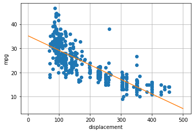
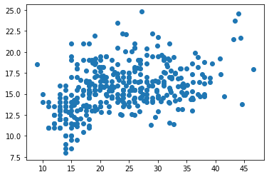

## **Lab 2: Simple Linear Regression**

### **1. Manipulate the data $fd_3$ \text{fd}_{398x6} **

Tasks: 

*   Load the data with: `pdf.read_csv()`
*   Show the array, get array size and list x items and get: `.values`, `.shape` & `.head()`
*   Display data of the column of cylinders & mpg: `df['cylinders']` & `df[['cylinders','mpg']]`


```python
import pandas as pd
import numpy as np
myhead = ['mpg','cylinder','displacement','horsepower','weight','acceleration','model year','origin','car name'];
fd = pd.read_csv('https://archive.ics.uci.edu/ml/machine-learning-databases/auto-mpg/auto-mpg.data',header=None,delim_whitespace=True,names=myhead,na_values='?');
fd.head(5)
```


<div>
<style scoped>
    .dataframe tbody tr th:only-of-type {
        vertical-align: middle;
    }

    .dataframe tbody tr th {
        vertical-align: top;
    }

    .dataframe thead th {
        text-align: right;
    }
</style>
<table border="1" class="dataframe">
  <thead>
    <tr style="text-align: right;">
      <th></th>
      <th>mpg</th>
      <th>cylinder</th>
      <th>displacement</th>
      <th>horsepower</th>
      <th>weight</th>
      <th>acceleration</th>
      <th>model year</th>
      <th>origin</th>
      <th>car name</th>
    </tr>
  </thead>
  <tbody>
    <tr>
      <th>0</th>
      <td>18.0</td>
      <td>8</td>
      <td>307.0</td>
      <td>130.0</td>
      <td>3504.0</td>
      <td>12.0</td>
      <td>70</td>
      <td>1</td>
      <td>chevrolet chevelle malibu</td>
    </tr>
    <tr>
      <th>1</th>
      <td>15.0</td>
      <td>8</td>
      <td>350.0</td>
      <td>165.0</td>
      <td>3693.0</td>
      <td>11.5</td>
      <td>70</td>
      <td>1</td>
      <td>buick skylark 320</td>
    </tr>
    <tr>
      <th>2</th>
      <td>18.0</td>
      <td>8</td>
      <td>318.0</td>
      <td>150.0</td>
      <td>3436.0</td>
      <td>11.0</td>
      <td>70</td>
      <td>1</td>
      <td>plymouth satellite</td>
    </tr>
    <tr>
      <th>3</th>
      <td>16.0</td>
      <td>8</td>
      <td>304.0</td>
      <td>150.0</td>
      <td>3433.0</td>
      <td>12.0</td>
      <td>70</td>
      <td>1</td>
      <td>amc rebel sst</td>
    </tr>
    <tr>
      <th>4</th>
      <td>17.0</td>
      <td>8</td>
      <td>302.0</td>
      <td>140.0</td>
      <td>3449.0</td>
      <td>10.5</td>
      <td>70</td>
      <td>1</td>
      <td>ford torino</td>
    </tr>
  </tbody>
</table>
</div>


```python
import numpy as np
import pandas as pd
import matplotlib
import matplotlib.pyplot as plt


%matplotlib inline

myhead = ['mpg','cylinder','displacement','horsepower','weight','acceleration','model year','origin','car name'];
fd = pd.read_csv('https://archive.ics.uci.edu/ml/machine-learning-databases/auto-mpg/auto-mpg.data',header=None,delim_whitespace=True,names=myhead,na_values='?');

x = np.array(fd['displacement']);
y = np.array(fd['mpg']);

```


```python
dfshow = fd[['displacement','horsepower']]
dfshow.head(4)
```


<div>
<style scoped>
    .dataframe tbody tr th:only-of-type {
        vertical-align: middle;
    }

    .dataframe tbody tr th {
        vertical-align: top;
    }

    .dataframe thead th {
        text-align: right;
    }
</style>
<table border="1" class="dataframe">
  <thead>
    <tr style="text-align: right;">
      <th></th>
      <th>displacement</th>
      <th>horsepower</th>
    </tr>
  </thead>
  <tbody>
    <tr>
      <th>0</th>
      <td>307.0</td>
      <td>130.0</td>
    </tr>
    <tr>
      <th>1</th>
      <td>350.0</td>
      <td>165.0</td>
    </tr>
    <tr>
      <th>2</th>
      <td>318.0</td>
      <td>150.0</td>
    </tr>
    <tr>
      <th>3</th>
      <td>304.0</td>
      <td>150.0</td>
    </tr>
  </tbody>
</table>
</div>


### **2. Compute the means ($\bar{x}, \bar{y}$), covariance ($S_{xy}, S_{xx}$) and $\beta$s as:**
$$
\begin{align}
\bar{x} &= \frac{1}{N}\sum_{i=1}^{N}{(x_i)} &
\bar{y} &= \frac{1}{N}\sum_{i=1}^{N}{(y_i)} \\
s_{xy} &= \frac{1}{N}\sum_{i=1}^{N}{(x_i-\bar{x})(y_i-\bar{y})} &
S^2_{x}  &= S_{xx}= \frac{1}{N}\sum_{i=1}^{N}{(x_i - \bar{x})^2} \\
\beta_1 &= \frac{S_{xy}}{S^2_{x}} = \frac{r_{xy}S_{y}}{S_{x}}&
\beta_0 &= \bar{y}-\beta_1\bar{x}\\
RSS_{(\beta_0,\beta_1)} &:=\sum^n_{i=1}{(y_i-\hat{y}_i)^2} &
\hat{y}_i &= \beta_1x_i + \beta_0
\end{align}
$$
Tasks:


*   Show values with decimals: `print({:.3f}.format(xm))` or `print('%.2f' %xm)`


```python
xm = np.mean(x);
ym = np.mean(y);

print("xm: %.2f" %xm,"and ym: %.2f" %ym)
print('thi is xm: {:.3f}'.format(xm),'thi is ym: {:.3f}'.format(ym))

syx = np.mean((y-ym)*(x-xm))
sxx = np.mean((x-xm)**2);
syy = np.mean((y-ym)**2);
beta1 = syx/sxx;
beta0 = ym - beta1*xm;
print("beta_1: ",beta1);
print("beta_0:",beta0);

#fig, ax = plt.subplots()
plt.plot(x,y,'o');
plt.xlabel('displacement');
plt.ylabel('mpg');
plt.grid(True)

#print(len(x))
xlines=np.linspace(1,500,600)      # from 1 to 10, by 50
plt.plot(xlines, beta0 +beta1*xlines )        # abline
plt.show()
```

    xm: 193.43 and ym: 23.51
    thi is xm: 193.426 thi is ym: 23.515
    beta_1:  -0.06028240546881722
    beta_0: 35.17475015429319


    

    


### **3. Pick interval with condition and drop NA values**
Tasks:

  **3.1**   Pick values of y (mpg) so that its acceleration `acc>25`<br>
  **3.2**  List items and drop the ones who don't have a value or are empty

Example: Pick all $a_n | b_n>2$
$$
a_n\,\,\,b_n\\
\begin{bmatrix}
6 & 2\\
8 & 4\\
4 & 8
\end{bmatrix}
$$
Then $a_n=\{8,4\}$, in programming to calculate the mean of such $a_n$ with that condition, it'll be `print(np.mean(an[bn>2]))` 


```python
val = np.array([[6,2],[8,4],[4,8]])
xn = val[:,0]
print(xn)
yn = val[:,1]
I = (yn>2)
print(I)
print(np.mean(xn*I)/np.mean(I))
print(np.mean(xn*I))
print(np.mean(xn[yn>2]))
```

    [6 8 4]
    [False  True  True]
    6.0
    4.0
    6.0


```python
#3.1 Pick values of y (mpg) so that its acceleration acc>25
# %%%%%%%%%%%%%%%%%%%%%%%%%%%%%%%%%%%%%%%%%%%%%%%%%%%%%%%%%%%%
acc = np.array(fd['acceleration'])
plt.plot(y,acc,'o')
print('Mean of mpg | acc>25: %.2f' %np.mean(y[acc>15]))
```

    Mean of mpg | acc>25: 25.85


    

    


```python
!jupyter nbconvert --execute --to markdown Lec02.ipynb
```

    [NbConvertApp] Converting notebook Lec02.ipynb to markdown
    [NbConvertApp] Support files will be in Lec02_files/
    [NbConvertApp] Making directory Lec02_files
    [NbConvertApp] Making directory Lec02_files
    [NbConvertApp] Writing 6509 bytes to Lec02.md

